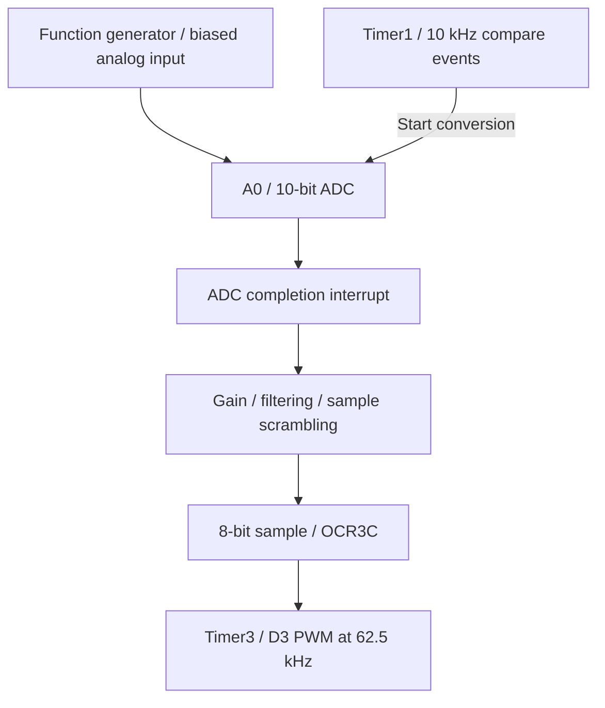

# Arduino Mega Real-Time DSP Signal Scrambler

A register-level embedded DSP project on the ATmega2560: sample a live analog signal, process it in an interrupt-driven pipeline, and encode the result as a high-frequency PWM duty cycle.

**Core project completed:** the operational ADC → DSP → PWM pipeline, comparator, digital gain, first-order low-pass filter, and double-buffered block scrambler are implemented. All eight development sketches are included, including the initial LFSR/XOR extension. LFSR characterization, a matching descrambler, spectral comparisons, and analog reconstruction remain future work.

## System architecture



Timer1 controls acquisition timing; Timer3 maintains the PWM carrier. Processing changes the duty cycle, not the carrier frequency. The current output is PWM, not a reconstructed analog waveform.

## Development progression

Each folder is an independent Arduino sketch. Source is preserved from the supplied project versions; filenames match their folders so Arduino IDE can open them directly.

| Stage | Sketch | Focus |
| --- | --- | --- |
| 01 | [Basic ADC/PWM](code/01_basic_adc_pwm/01_basic_adc_pwm.ino) | `analogRead(A0)` and 10-to-8-bit scaling with `sample >> 2` |
| 02 | [Timer verification](code/02_timer1_verification/02_timer1_verification.ino) | OC1A toggles on D11 to verify Timer1 events |
| 03 | [Interrupt ADC/PWM](code/03_interrupt_adc_pwm/03_interrupt_adc_pwm.ino) | Timer1 starts conversions; the ADC ISR updates PWM |
| 04 | [Comparator](code/04_comparator_dsp/04_comparator_dsp.ino) | Threshold live samples at 512 to produce a square-wave response |
| 05 | [Digital gain](code/05_digital_gain/05_digital_gain.ino) | `512 + (x - 512)/2`, with signed intermediate arithmetic |
| 06 | [Low-pass filter](code/06_low_pass_filter/06_low_pass_filter.ino) | Stateful first-order IIR: `y += (x - y)/4` |
| 07 | [Block scrambler](code/07_block_scrambler/07_block_scrambler.ino) | Two eight-sample buffers; fixed permutation `4, 0, 6, 2, 7, 1, 5, 3` |
| 08 | [LFSR/XOR scrambler](code/08_lfsr_xor_scrambler/08_lfsr_xor_scrambler.ino) | Initial 8-bit LFSR/XOR implementation; experimental characterization pending |

The fixed permutation maps `A B C D E F G H` to `E A G C H B F D`. One eight-sample block spans 0.8 ms at 10 kS/s. Double buffering allows capture and output to proceed in the same sample interrupt.

## Hardware and timing

Platform: ELEGOO / Arduino Mega 2560 R3, function generator, oscilloscope, breadboard, and jumper wires. Development uses Arduino IDE and C/C++.

| Parameter | Configuration |
| --- | --- |
| CPU | ATmega2560, 16 MHz |
| Input | A0 / ADC0, AVcc reference, 10-bit samples |
| Sampling events | Timer1 CTC, prescaler 8, OCR1A = 199: 10 kHz / 100 µs |
| ADC clock | Prescaler 64: 250 kHz; normal conversion approximately 52 µs |
| PWM | Timer3, 8-bit Fast PWM, prescaler 1: 62.5 kHz |
| PWM output | D3 / PE5 / OC3C |
| Timer diagnostic | D11 / PB5 / OC1A |

Stage 01 uses software-paced `analogRead()`; stage 02 is a timer-only diagnostic. The fixed-rate ADC pipeline begins at stage 03.

## Bench results

Recorded in the project testing notes:

| Test | Observation |
| --- | --- |
| Timer1 diagnostic output | 5.0 kHz square wave, consistent with two toggles per 10 kHz event pair |
| Comparator with approximately 1 kHz sine input | 1.0006 kHz output square wave |
| Timer3 PWM carrier | Approximately 62.5 kHz / 16 µs period |
| PWM high pulse widths | Approximately 6.8–9.6 µs, corresponding to 42.5–60% duty cycle |

These are the project's reported bench measurements. Scope image files have not been supplied yet; no simulated traces are substituted. See [testing notes](docs/testing_notes.md) for evidence scope and software checks.

## Run a sketch

1. Clone or download this repository.
2. Install **Arduino AVR Boards** in Arduino IDE and select **Arduino Mega or Mega 2560**, processor **ATmega2560**.
3. Open the `.ino` file for one stage inside its matching folder. Each stage is standalone; do not combine them into one sketch.
4. Select the connected board's port and upload that stage.
5. Use a biased input within the ADC supply range on A0 and a common signal ground. Measure D3 for PWM/DSP tests or D11 for stage 02. Verify the input amplitude and offset before connecting the generator.

Example with Arduino CLI:

```sh
arduino-cli compile --fqbn arduino:avr:mega:cpu=atmega2560 code/07_block_scrambler
```

No external sketch libraries are required. The code directly uses ATmega2560 registers and is not portable to an Uno without changes.

## Scope and next steps

The completed core demonstrates register-level programming, hardware timers, interrupt-driven acquisition, signed sample arithmetic, stateful filtering, double buffering, and temporal scrambling.

The LFSR/XOR extension uses seed `0xA7` and advances the sequence once per sample before XOR. It is signal obfuscation, not cryptographically secure encryption. A synchronized sequence can reverse XOR in the digital domain; a complete receiver or recovered analog waveform is not yet implemented.

Next: characterize stage 08, add a synchronized descrambler and sample recovery tests, publish scope captures, compare spectra, and implement a suitable reconstruction filter or external DAC.

- [Architecture and implementation details](docs/architecture.md)
- [Testing notes](docs/testing_notes.md)
- [Scope image guidance](images/README.md)
- [Design review and historical corrections](DESIGN_REVIEW.md)
