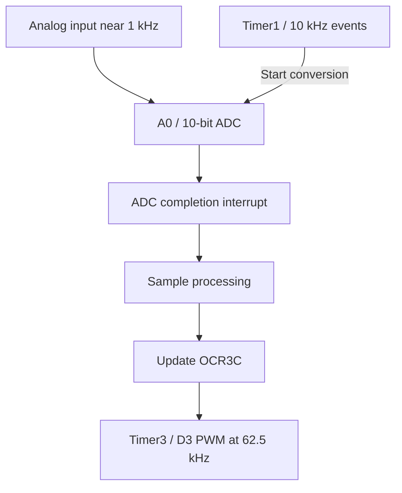

# Embedded DSP Signal Chain and Sample Scrambling

An Arduino Mega 2560 project that samples a live analog signal, processes it in an interrupt-driven pipeline, and outputs the result using PWM. The work progresses from ADC/PWM bring-up through digital gain and filtering to block-based sample reordering.

**Status: active hardware project.** As of September 2026, the implementation and bench observations below are reported by the project author. The current firmware and oscilloscope captures have not yet been uploaded, so this repository documents the work but does not yet provide a reproducible firmware release. LFSR/XOR scrambling and descrambling are the next planned stage.

## Architecture



The initial version used `analogRead(A0)` and `sample >> 2` to convert 10-bit ADC values to 8-bit PWM values. The current design directly configures the ATmega2560 ADC registers and uses Timer1 to start conversions at a controlled rate.

## Implemented experiments

These stages describe the author's reported hardware work, rather than source code independently reviewed in this repository.

| Stage | Implementation | What it demonstrates |
| --- | --- | --- |
| ADC to PWM | 10-bit input, 8-bit output, Timer3 PWM on D3 | Sample conversion and output duty-cycle control |
| Controlled sampling | Timer1 events at 10 kHz; conversion completion handled by ADC interrupt | A nominal 100 µs sample period, about 10 samples per 1 kHz input cycle |
| Comparator | Output 255 when `x > 512`, otherwise 0 | A digital decision applied to live input |
| Digital gain | `y = 512 + (x - 512)/2` | Amplitude reduction around the ADC midpoint |
| First-order low-pass filter | `y[n] = y[n-1] + (x[n] - y[n-1])/4` | Stateful sample-by-sample filtering |
| Block scrambling | Eight-sample blocks reordered as `4, 0, 6, 2, 7, 1, 5, 3`; two buffers alternate capture/output | Temporal sample reordering and buffered processing |

The gain and filter equations describe the 10-bit sample domain. The current source is needed to document exact signed arithmetic, initialization, scaling, and buffer timing.

## Reported bench observations

| Observation | Reported value | Interpretation |
| --- | --- | --- |
| Timer1 hardware output, D11 / OC1A | 5.0 kHz | One toggle per timer event is consistent with 10 kHz events; this alone does not measure completed ADC throughput or jitter |
| Comparator output, D3 | 1.0006 kHz square wave for an approximately 1 kHz sine input | Evidence of live sampling, threshold processing, and output response |
| PWM carrier | 62.5 kHz | A 16 µs PWM period |
| PWM pulse widths during processing | Approximately 6.8–9.6 µs | Approximately 42.5–60% duty cycle, calculated from the reported carrier period |

These numerical observations are supplied by the author. No synthetic plots, simulator screenshots, or reconstructed scope captures are presented as measurements.

## Hardware and tools

The project notes list an Elegoo MEGA 2560 R3, Victor VC2002 function generator, Hanmatek DOS1102 oscilloscope, breadboard components, and Arduino IDE. Earlier bring-up used two 10 kΩ resistors and a 0.1 µF coupling capacitor for input biasing, with reported input values around 0.5–4.4 V and a midpoint near 2.5 V. The current schematic and analog reconstruction results still need to be recorded.

## Next stage: reversible digital scrambling

The planned extension uses a deterministic LFSR sequence `p[n]` and XOR:

```text
scrambled[n] = sample[n] XOR p[n]
recovered[n] = scrambled[n] XOR p[n]
```

The intended chain is ADC → digital scrambler → digital descrambler → PWM. Exact digital recovery requires the same sequence, seed, sample width, and alignment. Recovery after analog reconstruction and re-sampling is a separate experiment. LFSR/XOR and fixed permutations are educational scrambling techniques, not secure encryption.

## Next evidence to publish

1. The actual current `.ino` files, with board selection, timer configuration, and build instructions.
2. Scope captures for Timer1 timing, comparator output, and PWM carrier/pulse widths, with probe and timebase settings.
3. A buffer-order test showing the input sequence and emitted permutation, including startup behavior and latency.
4. A digital scrambler/descrambler round-trip test once implemented.
5. A checked analog schematic and bypass/filter measurements before claiming reconstructed waveform performance.

[Design review and validation plan](DESIGN_REVIEW.md) records the historical document conflicts and the remaining engineering checks.
