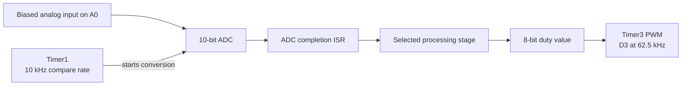

# Interrupt-Driven DSP Pipeline on ATmega2560

An embedded C++ project for the Arduino Mega 2560 that progresses from basic ADC-to-PWM passthrough to timer-paced acquisition, sample-domain processing, block permutation, and an experimental LFSR/XOR transform. The sketches configure the ATmega2560 peripherals directly so that sampling and output timing remain explicit.

## What this project demonstrates

- Direct configuration of AVR timers, ADC, PWM, and interrupts
- Timer-paced sampling at a nominal 10 kS/s
- 8-bit Fast PWM output with a 62.5 kHz carrier
- Signed sample arithmetic and a first-order integer IIR filter
- Double-buffered processing of eight-sample blocks
- Deterministic sample permutation and an experimental LFSR-based transform
- Progressive development through small, independently runnable sketches

## Signal path



Timer1 establishes the acquisition cadence and Timer3 maintains the PWM carrier. The firmware changes PWM duty cycle to represent processed samples; it does not include an analog reconstruction filter or DAC.

## Development stages

Each directory contains a standalone Arduino sketch.

| Stage | Sketch | Implementation focus |
| --- | --- | --- |
| 01 | [Basic ADC/PWM](code/01_basic_adc_pwm/01_basic_adc_pwm.ino) | Poll A0 with `analogRead()` and scale 10-bit samples to 8-bit PWM |
| 02 | [Timer verification](code/02_timer1_verification/02_timer1_verification.ino) | Toggle OC1A on D11 to expose the Timer1 compare cadence |
| 03 | [Interrupt ADC/PWM](code/03_interrupt_adc_pwm/03_interrupt_adc_pwm.ino) | Start ADC conversions from Timer1 and update PWM in the ADC ISR |
| 04 | [Comparator](code/04_comparator_dsp/04_comparator_dsp.ino) | Threshold samples at midscale to produce a two-level output |
| 05 | [Digital gain](code/05_digital_gain/05_digital_gain.ino) | Apply midpoint-centered attenuation with signed arithmetic |
| 06 | [Low-pass filter](code/06_low_pass_filter/06_low_pass_filter.ino) | Apply the integer recurrence `y += (x - y) / 4` |
| 07 | [Block scrambler](code/07_block_scrambler/07_block_scrambler.ino) | Capture and output alternating eight-sample buffers through a fixed permutation |
| 08 | [LFSR/XOR experiment](code/08_lfsr_xor_scrambler/08_lfsr_xor_scrambler.ino) | XOR each 8-bit sample with an advancing 8-bit LFSR sequence |

The block permutation maps `A B C D E F G H` to `E A G C H B F D`. At the nominal sample rate, each block spans 0.8 ms. Static initialization makes the first output block zero-filled while the first input block is captured.

## Key configuration

| Parameter | Configuration |
| --- | --- |
| MCU | ATmega2560 at 16 MHz |
| Input | ADC0 / A0, AVcc reference, 10-bit samples |
| Sampling trigger | Timer1 CTC, prescaler 8, `OCR1A = 199` |
| Nominal compare rate | 10 kHz / 100 µs |
| ADC clock | 250 kHz with prescaler 64 |
| Output | Timer3 channel C, D3 / PE5 / OC3C |
| PWM mode | 8-bit Fast PWM, prescaler 1 |
| PWM carrier | 62.5 kHz |
| Timer diagnostic | D11 / PB5 / OC1A |

Stage 01 is software-paced and stage 02 is a timer-only diagnostic. The interrupt-driven ADC pipeline begins at stage 03.

## Evidence and current scope

The source establishes the peripheral configuration and processing algorithms described above. Development notes also record preliminary oscilloscope observations of a 5.0 kHz Timer1 diagnostic waveform, an approximately 62.5 kHz PWM carrier, and a 1.0006 kHz comparator output for an approximately 1 kHz input.

Those bench values are retained as observations, not independently reproducible results: the repository does not currently include the original scope captures, exact generator settings, or a hardware test log. See [testing notes](docs/testing_notes.md) for the evidence boundary and recommended next measurements.

## Run a sketch

1. Install **Arduino AVR Boards** in Arduino IDE.
2. Select **Arduino Mega or Mega 2560** with the **ATmega2560** processor.
3. Open one `.ino` file from its matching directory. The stages are independent and should not be combined.
4. Connect a properly biased signal to A0 and share ground between the signal source and board.
5. Upload the sketch and observe D3 for PWM/DSP stages or D11 for the timer diagnostic.

Example Arduino CLI command:

```sh
arduino-cli compile --fqbn arduino:avr:mega:cpu=atmega2560 code/07_block_scrambler
```

No external sketch libraries are required. The register configuration targets the ATmega2560 and is not portable to an Arduino Uno without changes.

> [!CAUTION]
> Keep A0 within the board's input range and verify generator amplitude, DC offset, and common ground before connecting test equipment.

## Limitations and next steps

- The output remains PWM until it is passed through a suitable reconstruction stage or replaced by a DAC.
- The ADC clock and end-to-end timing have not been characterized for effective resolution, latency, or jitter.
- Stage 08 has no matching descrambler, synchronization protocol, or recovered-signal test.
- The LFSR/XOR stage is a signal-obfuscation experiment, not cryptographic encryption.

Useful next steps are to add reproducible build checks, capture input/output waveforms with full test settings, test block ordering with known sample vectors, implement a synchronized digital descrambler, and compare original and recovered samples quantitatively.

## Documentation

- [Architecture and implementation details](docs/architecture.md)
- [Testing status and measurement plan](docs/testing_notes.md)
- [Implementation review](DESIGN_REVIEW.md)
